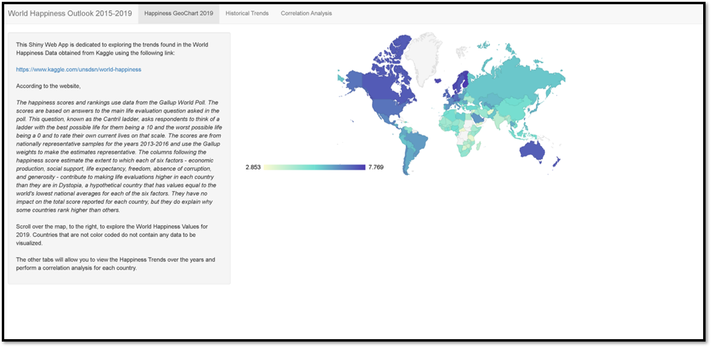

```{r setup, include=FALSE}
knitr::opts_chunk$set(echo = FALSE)
```


## **Purpose & Data Source**

This Shiny Web App is dedicated to exploring the trends found in the World Happiness Data obtained from Kaggle using the following link:

<https://www.kaggle.com/unsdsn/world-happiness>


## **Data Description**

- Happiness scores & rankings use data from the Gallup World Poll 

- Scores are based on answers to the main life evaluation question asked in the poll.        
        
- Scores are from nationally representative samples for the years 2013-2016 & use the Gallup weights to make the estimates representative.    
- Six factors that can contribute to making life evaluations higher in each country - e.g., economic production, social support, life expectancy, freedom, absence of corruption, and generosity.

    + They have no impact on the total score reported for each country, but they do explain why some countries rank higher than others.


## **Happiness Shiny App**

- **Tab 1:** Happiness GeoChart 2019
    + Allows you to explore the happiness data for 2019.

- **Tab 2:** Historical Trends 
    + Allows you to explore historical happiness trends for each country from 2015-2019.

- **Tab 3:** Correlation Analysis
    + Allows you to perform correlation analysis to see which of the six factors are correlated with happiness score & each other.


---
```{r echo=FALSE, fig.align='center'}
   
```